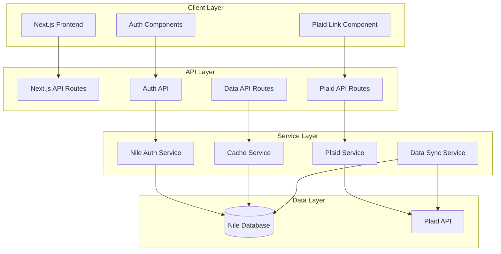
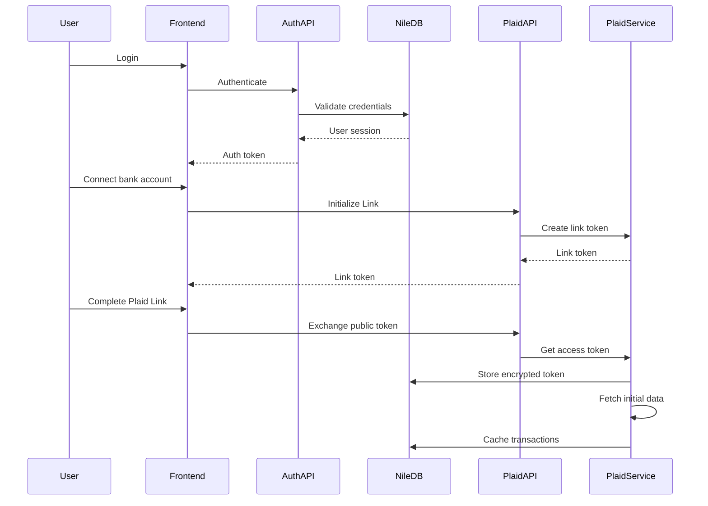

# Design Document

## Overview

This design document outlines the integration of Plaid API for financial data aggregation with Nile DB for authentication, user management, and caching in the Fiscus financial tracker application. The solution leverages Next.js 15 with React 19, utilizing Nile DB's multi-tenant architecture for secure user data isolation and Plaid's robust financial data APIs for bank account connectivity.

The architecture follows a layered approach with clear separation between authentication, data access, and presentation layers. Nile DB serves as both the authentication provider and primary data store, while Plaid provides real-time financial data that gets cached and synchronized for optimal performance.

## Architecture

### System Architecture



### Data Flow Architecture



## Components and Interfaces

### Authentication Components

#### NileAuthProvider
- **Purpose**: Manages authentication state and session handling
- **Location**: `lib/auth/nile-auth-provider.tsx`
- **Key Methods**:
  - `signIn(email: string, password: string): Promise<AuthResult>`
  - `signUp(userData: SignUpData): Promise<AuthResult>`
  - `signOut(): Promise<void>`
  - `getCurrentUser(): User | null`

#### AuthGuard
- **Purpose**: Protects routes requiring authentication
- **Location**: `components/auth/auth-guard.tsx`
- **Props**: `children: ReactNode, redirectTo?: string`

### Plaid Integration Components

#### PlaidLinkButton
- **Purpose**: Initiates Plaid Link flow for bank account connection
- **Location**: `components/plaid/plaid-link-button.tsx`
- **Props**: `onSuccess: (publicToken: string) => void, onExit?: () => void`

#### AccountsList
- **Purpose**: Displays connected bank accounts with balances
- **Location**: `components/plaid/accounts-list.tsx`
- **Props**: `accounts: Account[], onRefresh?: () => void`

#### TransactionsList
- **Purpose**: Renders cached transaction data with real-time updates
- **Location**: `components/plaid/transactions-list.tsx`
- **Props**: `transactions: Transaction[], loading?: boolean`

### Service Layer Interfaces

#### PlaidService Interface
```typescript
interface PlaidService {
  createLinkToken(userId: string): Promise<string>
  exchangePublicToken(publicToken: string, userId: string): Promise<void>
  getAccounts(userId: string): Promise<Account[]>
  getTransactions(userId: string, options?: TransactionOptions): Promise<Transaction[]>
  syncTransactions(userId: string): Promise<SyncResult>
  revokeAccess(itemId: string, userId: string): Promise<void>
}
```

#### CacheService Interface
```typescript
interface CacheService {
  getTransactions(userId: string, filters?: TransactionFilters): Promise<Transaction[]>
  cacheTransactions(userId: string, transactions: Transaction[]): Promise<void>
  getAccounts(userId: string): Promise<Account[]>
  cacheAccounts(userId: string, accounts: Account[]): Promise<void>
  invalidateCache(userId: string, type: CacheType): Promise<void>
}
```

## Data Models

### User Model (Nile DB)
```typescript
interface User {
  id: string
  email: string
  firstName: string
  lastName: string
  phone?: string
  company?: string
  createdAt: Date
  updatedAt: Date
  tenantId: string // Nile multi-tenancy
}
```

### PlaidConnection Model
```typescript
interface PlaidConnection {
  id: string
  userId: string
  itemId: string
  accessToken: string // Encrypted
  institutionId: string
  institutionName: string
  accounts: string[] // Account IDs
  status: 'active' | 'error' | 'disconnected'
  lastSync: Date
  createdAt: Date
  updatedAt: Date
}
```

### Account Model
```typescript
interface Account {
  id: string
  userId: string
  plaidAccountId: string
  connectionId: string
  name: string
  officialName?: string
  type: 'depository' | 'credit' | 'loan' | 'investment'
  subtype: string
  balance: {
    available?: number
    current: number
    limit?: number
  }
  lastUpdated: Date
}
```

### Transaction Model
```typescript
interface Transaction {
  id: string
  userId: string
  accountId: string
  plaidTransactionId: string
  amount: number
  date: Date
  name: string
  merchantName?: string
  category: string[]
  subcategory?: string
  pending: boolean
  accountOwner?: string
  createdAt: Date
  updatedAt: Date
}
```

### Database Schema (Nile DB)

```sql
-- Users table (managed by Nile)
-- Nile automatically handles user management and multi-tenancy

-- Plaid connections table
CREATE TABLE plaid_connections (
  id UUID PRIMARY KEY DEFAULT gen_random_uuid(),
  user_id UUID NOT NULL REFERENCES users(id),
  item_id VARCHAR(255) NOT NULL,
  access_token TEXT NOT NULL, -- Encrypted
  institution_id VARCHAR(255) NOT NULL,
  institution_name VARCHAR(255) NOT NULL,
  accounts TEXT[], -- Array of account IDs
  status VARCHAR(50) DEFAULT 'active',
  last_sync TIMESTAMP WITH TIME ZONE,
  created_at TIMESTAMP WITH TIME ZONE DEFAULT NOW(),
  updated_at TIMESTAMP WITH TIME ZONE DEFAULT NOW(),
  UNIQUE(user_id, item_id)
);

-- Accounts table
CREATE TABLE accounts (
  id UUID PRIMARY KEY DEFAULT gen_random_uuid(),
  user_id UUID NOT NULL REFERENCES users(id),
  plaid_account_id VARCHAR(255) NOT NULL,
  connection_id UUID NOT NULL REFERENCES plaid_connections(id),
  name VARCHAR(255) NOT NULL,
  official_name VARCHAR(255),
  type VARCHAR(50) NOT NULL,
  subtype VARCHAR(50) NOT NULL,
  balance_available DECIMAL(12,2),
  balance_current DECIMAL(12,2) NOT NULL,
  balance_limit DECIMAL(12,2),
  last_updated TIMESTAMP WITH TIME ZONE DEFAULT NOW(),
  created_at TIMESTAMP WITH TIME ZONE DEFAULT NOW(),
  updated_at TIMESTAMP WITH TIME ZONE DEFAULT NOW(),
  UNIQUE(user_id, plaid_account_id)
);

-- Transactions table
CREATE TABLE transactions (
  id UUID PRIMARY KEY DEFAULT gen_random_uuid(),
  user_id UUID NOT NULL REFERENCES users(id),
  account_id UUID NOT NULL REFERENCES accounts(id),
  plaid_transaction_id VARCHAR(255) NOT NULL,
  amount DECIMAL(12,2) NOT NULL,
  date DATE NOT NULL,
  name VARCHAR(255) NOT NULL,
  merchant_name VARCHAR(255),
  category TEXT[], -- Array of categories
  subcategory VARCHAR(255),
  pending BOOLEAN DEFAULT FALSE,
  account_owner VARCHAR(255),
  created_at TIMESTAMP WITH TIME ZONE DEFAULT NOW(),
  updated_at TIMESTAMP WITH TIME ZONE DEFAULT NOW(),
  UNIQUE(user_id, plaid_transaction_id)
);

-- Indexes for performance
CREATE INDEX idx_transactions_user_date ON transactions(user_id, date DESC);
CREATE INDEX idx_transactions_account ON transactions(account_id);
CREATE INDEX idx_accounts_user ON accounts(user_id);
CREATE INDEX idx_plaid_connections_user ON plaid_connections(user_id);
```

## Error Handling

### Error Types and Handling Strategy

#### Authentication Errors
- **Invalid Credentials**: Return 401 with user-friendly message
- **Session Expired**: Redirect to login with session restoration
- **Account Locked**: Implement progressive delays and admin notification

#### Plaid API Errors
- **Rate Limiting**: Implement exponential backoff with jitter
- **Institution Errors**: Display institution-specific error messages
- **Token Expiration**: Automatic re-authentication flow
- **Maintenance Mode**: Graceful degradation to cached data

#### Database Errors
- **Connection Failures**: Retry logic with circuit breaker pattern
- **Constraint Violations**: User-friendly validation messages
- **Timeout Errors**: Fallback to cached data when appropriate

### Error Response Format
```typescript
interface ErrorResponse {
  error: {
    code: string
    message: string
    details?: any
    timestamp: string
    requestId: string
  }
}
```

### Logging Strategy
- **Authentication Events**: Audit log all login attempts and access
- **Plaid Operations**: Log all API calls with sanitized data
- **Performance Metrics**: Track response times and cache hit rates
- **Error Tracking**: Structured logging with correlation IDs

## Testing Strategy

### Unit Testing
- **Service Layer**: Mock external dependencies (Plaid API, Nile DB)
- **Utility Functions**: Test data transformation and validation logic
- **Components**: Test rendering and user interactions with React Testing Library

### Integration Testing
- **API Routes**: Test complete request/response cycles
- **Database Operations**: Test with test database instance
- **Plaid Integration**: Use Plaid sandbox environment

### End-to-End Testing
- **Authentication Flow**: Complete sign-up and sign-in processes
- **Bank Connection**: Plaid Link integration with test institutions
- **Data Synchronization**: Verify transaction caching and updates

### Security Testing
- **Token Security**: Verify encryption and secure storage
- **SQL Injection**: Test all database queries with malicious inputs
- **XSS Prevention**: Validate all user input sanitization
- **CSRF Protection**: Test API route protection

### Performance Testing
- **Cache Performance**: Measure cache hit rates and response times
- **Database Queries**: Analyze query performance and optimization
- **API Rate Limits**: Test Plaid API rate limiting handling
- **Concurrent Users**: Load testing with multiple simultaneous users

### Test Data Management
- **Plaid Sandbox**: Use test institutions and accounts
- **Database Seeding**: Automated test data creation and cleanup
- **User Isolation**: Ensure test users don't interfere with each other

The testing strategy ensures comprehensive coverage across all layers while maintaining security and performance standards throughout the development process.