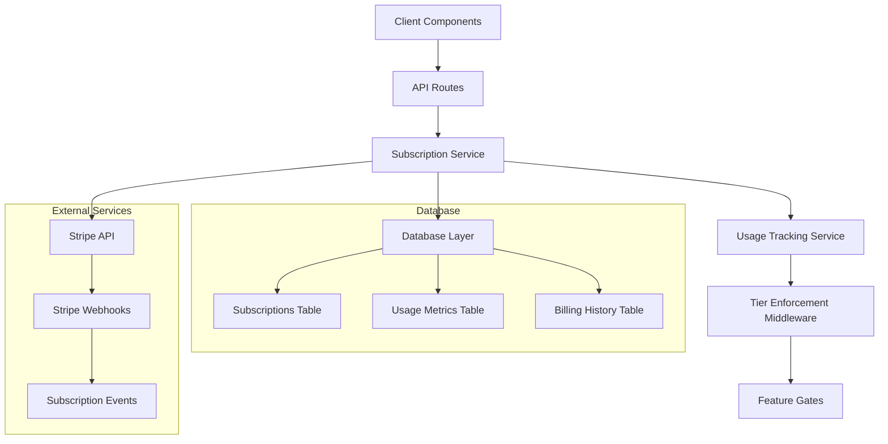

# Design Document

## Overview

The pricing system will be implemented as a comprehensive subscription management solution integrated into the existing Next.js finance dashboard. The system will use Stripe for payment processing, implement tier-based access control throughout the application, and provide seamless upgrade/downgrade experiences with real-time limit enforcement.

## Architecture

### High-Level Architecture



### Component Architecture

The system will be built using a layered architecture:

1. **Presentation Layer**: React components for pricing pages, subscription management, and upgrade prompts
2. **API Layer**: Next.js API routes for subscription operations and webhook handling
3. **Business Logic Layer**: Services for subscription management, usage tracking, and tier enforcement
4. **Data Layer**: Prisma models for subscription data and usage metrics
5. **Integration Layer**: Stripe SDK integration for payment processing

## Components and Interfaces

### Database Schema Extensions

```typescript
// New Prisma models to add to schema.prisma

model Subscription {
  id                String            @id @default(uuid()) @db.Uuid
  userId            String            @unique @map("user_id") @db.Uuid
  stripeCustomerId  String?           @unique @map("stripe_customer_id")
  stripeSubscriptionId String?        @unique @map("stripe_subscription_id")
  tier              SubscriptionTier  @default(STARTER)
  status            SubscriptionStatus @default(ACTIVE)
  billingCycle      BillingCycle      @default(MONTHLY) @map("billing_cycle")
  currentPeriodStart DateTime?        @map("current_period_start") @db.Timestamptz(6)
  currentPeriodEnd   DateTime?        @map("current_period_end") @db.Timestamptz(6)
  cancelAtPeriodEnd  Boolean          @default(false) @map("cancel_at_period_end")
  trialEnd          DateTime?         @map("trial_end") @db.Timestamptz(6)
  createdAt         DateTime          @default(now()) @map("created_at") @db.Timestamptz(6)
  updatedAt         DateTime          @updatedAt @map("updated_at") @db.Timestamptz(6)
  
  usageMetrics      UsageMetric[]
  billingHistory    BillingHistory[]
  
  @@index([userId])
  @@index([stripeCustomerId])
  @@index([status])
  @@index([tier])
  @@map("subscriptions")
  @@schema("public")
}

model UsageMetric {
  id             String   @id @default(uuid()) @db.Uuid
  subscriptionId String   @map("subscription_id") @db.Uuid
  userId         String   @map("user_id") @db.Uuid
  metricType     String   @map("metric_type") @db.VarChar(50)
  currentValue   Int      @map("current_value")
  limitValue     Int      @map("limit_value")
  periodStart    DateTime @map("period_start") @db.Timestamptz(6)
  periodEnd      DateTime @map("period_end") @db.Timestamptz(6)
  createdAt      DateTime @default(now()) @map("created_at") @db.Timestamptz(6)
  updatedAt      DateTime @updatedAt @map("updated_at") @db.Timestamptz(6)
  
  subscription   Subscription @relation(fields: [subscriptionId], references: [id], onDelete: Cascade)
  
  @@unique([subscriptionId, metricType, periodStart])
  @@index([userId])
  @@index([metricType])
  @@index([periodStart, periodEnd])
  @@map("usage_metrics")
  @@schema("public")
}

model BillingHistory {
  id                String   @id @default(uuid()) @db.Uuid
  subscriptionId    String   @map("subscription_id") @db.Uuid
  userId            String   @map("user_id") @db.Uuid
  stripeInvoiceId   String?  @map("stripe_invoice_id")
  amount            Decimal  @db.Decimal(10, 2)
  currency          String   @default("usd") @db.VarChar(3)
  status            String   @db.VarChar(20)
  billingReason     String   @map("billing_reason") @db.VarChar(50)
  periodStart       DateTime @map("period_start") @db.Timestamptz(6)
  periodEnd         DateTime @map("period_end") @db.Timestamptz(6)
  paidAt            DateTime? @map("paid_at") @db.Timestamptz(6)
  createdAt         DateTime @default(now()) @map("created_at") @db.Timestamptz(6)
  
  subscription      Subscription @relation(fields: [subscriptionId], references: [id], onDelete: Cascade)
  
  @@index([userId])
  @@index([subscriptionId])
  @@index([status])
  @@index([createdAt])
  @@map("billing_history")
  @@schema("public")
}

enum SubscriptionTier {
  STARTER
  GROWTH
  PRO
}

enum SubscriptionStatus {
  ACTIVE
  CANCELED
  PAST_DUE
  UNPAID
  TRIALING
}

enum BillingCycle {
  MONTHLY
  YEARLY
}
```

### Core Services

#### SubscriptionService

```typescript
interface SubscriptionService {
  // Subscription management
  createSubscription(userId: string, tier: SubscriptionTier, billingCycle: BillingCycle): Promise<Subscription>
  updateSubscription(subscriptionId: string, updates: Partial<Subscription>): Promise<Subscription>
  cancelSubscription(subscriptionId: string, cancelAtPeriodEnd: boolean): Promise<Subscription>
  
  // Usage tracking
  trackUsage(userId: string, metricType: string, increment: number): Promise<void>
  checkUsageLimit(userId: string, metricType: string): Promise<boolean>
  getCurrentUsage(userId: string): Promise<UsageMetric[]>
  
  // Tier management
  getUserTier(userId: string): Promise<SubscriptionTier>
  getTierLimits(tier: SubscriptionTier): TierLimits
  canPerformAction(userId: string, action: string): Promise<boolean>
}
```

#### TierEnforcementService

```typescript
interface TierEnforcementService {
  enforceAccountLimit(userId: string): Promise<boolean>
  enforceBalanceLimit(userId: string, totalBalance: number): Promise<boolean>
  enforceFeatureAccess(userId: string, feature: string): Promise<boolean>
  enforceSyncFrequency(userId: string): Promise<string>
  enforceTransactionHistory(userId: string): Promise<number>
}
```

#### StripeService

```typescript
interface StripeService {
  createCustomer(userId: string, email: string): Promise<string>
  createSubscription(customerId: string, priceId: string): Promise<string>
  updateSubscription(subscriptionId: string, priceId: string): Promise<void>
  cancelSubscription(subscriptionId: string): Promise<void>
  createPaymentIntent(amount: number, customerId: string): Promise<string>
  handleWebhook(event: Stripe.Event): Promise<void>
}
```

### API Endpoints

#### Subscription Management
- `POST /api/subscriptions` - Create new subscription
- `GET /api/subscriptions` - Get user's subscription details
- `PUT /api/subscriptions` - Update subscription
- `DELETE /api/subscriptions` - Cancel subscription
- `POST /api/subscriptions/upgrade` - Upgrade subscription tier
- `POST /api/subscriptions/downgrade` - Downgrade subscription tier

#### Usage Tracking
- `GET /api/usage` - Get current usage metrics
- `POST /api/usage/track` - Track usage event
- `GET /api/usage/limits` - Get tier limits and current usage

#### Billing
- `GET /api/billing/history` - Get billing history
- `POST /api/billing/payment-method` - Update payment method
- `POST /api/billing/invoice` - Generate invoice

#### Webhooks
- `POST /api/webhooks/stripe` - Handle Stripe webhooks

### React Components

#### Pricing Components
- `PricingPage` - Main pricing page with tier comparison
- `PricingCard` - Individual tier pricing card
- `UpgradePrompt` - Modal/banner for upgrade prompts
- `FeatureLockDialog` - Dialog shown when feature is locked

#### Subscription Management
- `SubscriptionSettings` - Subscription management interface
- `BillingHistory` - Billing history display
- `PaymentMethodForm` - Payment method update form
- `PlanChangeConfirmation` - Confirmation dialog for plan changes

#### Usage Tracking
- `UsageIndicator` - Progress bar showing usage vs limits
- `AccountLimitBanner` - Banner showing account limit status
- `BalanceLimitWarning` - Warning when approaching balance limit

## Data Models

### Tier Configuration

```typescript
interface TierLimits {
  accounts: number | 'unlimited'
  balanceLimit: number | 'unlimited'
  transactionHistoryMonths: number | 'unlimited'
  syncFrequency: 'daily' | 'realtime' | 'priority'
  features: string[]
  support: 'none' | 'email' | 'priority_chat'
}

const TIER_CONFIGS: Record<SubscriptionTier, TierLimits> = {
  STARTER: {
    accounts: 3,
    balanceLimit: 15000,
    transactionHistoryMonths: 12,
    syncFrequency: 'daily',
    features: ['basic_budgeting', 'goal_tracking', 'mobile_web_access'],
    support: 'none'
  },
  GROWTH: {
    accounts: 10,
    balanceLimit: 100000,
    transactionHistoryMonths: 'unlimited',
    syncFrequency: 'realtime',
    features: ['csv_export', 'spending_insights', 'trends_analysis'],
    support: 'email'
  },
  PRO: {
    accounts: 'unlimited',
    balanceLimit: 'unlimited',
    transactionHistoryMonths: 'unlimited',
    syncFrequency: 'priority',
    features: ['investment_tracking', 'tax_reports', 'ai_insights', 'multi_currency'],
    support: 'priority_chat'
  }
}
```

### Usage Metrics Types

```typescript
enum UsageMetricType {
  CONNECTED_ACCOUNTS = 'connected_accounts',
  TOTAL_BALANCE = 'total_balance',
  TRANSACTION_EXPORTS = 'transaction_exports',
  API_CALLS = 'api_calls',
  SYNC_REQUESTS = 'sync_requests'
}
```

## Error Handling

### Tier Enforcement Errors

```typescript
class TierLimitExceededError extends Error {
  constructor(
    public limitType: string,
    public currentValue: number,
    public limitValue: number,
    public requiredTier: SubscriptionTier
  ) {
    super(`${limitType} limit exceeded: ${currentValue}/${limitValue}. Upgrade to ${requiredTier} required.`)
  }
}

class FeatureNotAvailableError extends Error {
  constructor(
    public feature: string,
    public requiredTier: SubscriptionTier
  ) {
    super(`Feature '${feature}' requires ${requiredTier} tier.`)
  }
}
```

### Payment Processing Errors

```typescript
class PaymentFailedError extends Error {
  constructor(public stripeError: Stripe.StripeError) {
    super(`Payment failed: ${stripeError.message}`)
  }
}

class SubscriptionUpdateError extends Error {
  constructor(message: string, public subscriptionId: string) {
    super(`Subscription update failed for ${subscriptionId}: ${message}`)
  }
}
```

## Testing Strategy

### Unit Tests
- Service layer methods for subscription management
- Tier enforcement logic
- Usage tracking calculations
- Stripe integration functions
- Component rendering and interactions

### Integration Tests
- API endpoint functionality
- Database operations
- Stripe webhook handling
- End-to-end subscription flows

### E2E Tests
- Complete upgrade/downgrade flows
- Payment processing
- Tier limit enforcement
- Usage tracking accuracy

### Test Data
- Mock Stripe customers and subscriptions
- Test webhook events
- Usage scenarios for each tier
- Edge cases for limit enforcement

## Security Considerations

### Payment Security
- Use Stripe's secure payment processing
- Never store credit card information locally
- Implement proper webhook signature verification
- Use HTTPS for all payment-related communications

### Access Control
- Implement proper authentication for subscription endpoints
- Validate user ownership of subscriptions
- Use rate limiting on subscription API endpoints
- Audit all subscription changes

### Data Protection
- Encrypt sensitive subscription data
- Implement proper data retention policies
- Ensure GDPR compliance for billing data
- Secure webhook endpoints with proper validation

## Performance Considerations

### Caching Strategy
- Cache tier configurations in memory
- Cache user subscription status with short TTL
- Use Redis for usage metrics caching
- Implement efficient database queries with proper indexing

### Database Optimization
- Index frequently queried fields (userId, tier, status)
- Partition usage metrics by time periods
- Implement efficient aggregation queries
- Use connection pooling for database access

### Real-time Updates
- Use WebSocket connections for real-time usage updates
- Implement efficient event broadcasting
- Cache frequently accessed tier limits
- Optimize Stripe webhook processing

## Monitoring and Analytics

### Metrics to Track
- Subscription conversion rates by tier
- Churn rates and reasons
- Usage patterns by tier
- Payment success/failure rates
- Feature adoption rates

### Alerting
- Failed payment processing
- Webhook processing failures
- Unusual usage patterns
- Subscription cancellations

### Reporting
- Monthly recurring revenue (MRR)
- Customer lifetime value (CLV)
- Tier distribution and trends
- Usage analytics by feature